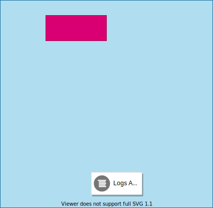
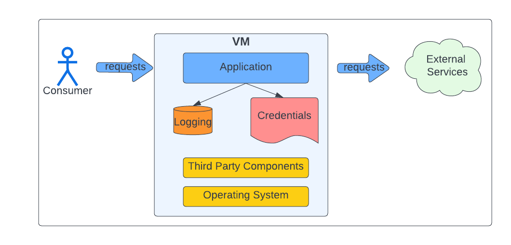

Companies typically concentrate on their primary applications/services as they analyze their cloud migration strategy. In most cases, these applications tend to have well-defined support & security models. When doing an inventory of applications, most corporations start to uncover "skeleton applications."

## Do you have skeletons hiding in your closet?

Examples of skeletons that could be hiding in your closet:
* typically organically developed to serve a specific purpose
* contains code with little to no new development
* one-offs
* written in older languages such as Perl, Bash, or 'C' (Does anybody remember TCL?)
* Rogue applications
* Little to no support
* Sketchy security/network architecture
* Different OS and versions or different application stacks
* No formal Dev-Ops support

In my years of development, I have run across a wide gamut of these types of applications:
* A significant vendor ran a phone home service on a desktop machine in someone's office
* Another vendor had several organically developed applications written in PHP, Perl, NodeJS & Python.
* Production builds artifacts metadata server running in a desktop machine. (And yes, this ran in someone's office.)

## Logical functional breakdown that is used by most applications

* Ingress connection management is managed by a web server or within the application.
* Egress (DB, Rest I/F) connection management is typically embedded within the application.
* Credentials/Secrets are typically just managed as files/environment variables, Not easily rotated/centrally managed.
* Logs are local, with no central visibility.
* Although the application will only utilize a small number of third-party packages, third-party package bloat is typically caused by dependencies on supporting functions.
* OS may not be up to date, security updates?

 
## Lift-And-Shift to the rescue

Insert diagram

Most corporations treat these applications as a nuisance and take a lift-and-shift approach. The thought is that this model provides a quicker migration to the cloud. There are several problems with this model:
* VM instance sprawl as each application is moved over in a 1-to-1 conversion (Many one-off deployment instances)
* VM image sprawl as each application may have there own dependencies which may require a separate VM image template
* Network architecture issues (i.e., Load Balancing, Authentication, Firewalling)
* Security issues
* Observability issues (logging, metrics)

In summary, you are not only moving the applications to the cloud, but in most instances, an organization is bringing these applications under a proper support/security model. A lift-and-shift migration moves the problem to the cloud unless a team undergoes a "potentially size-able" development effort. 

---

## Service Mesh to the rescue

Typical Kubernetes deployment with ISTIO

The following is a typical Kubernetes Pod Deployment that utilizes an ISTIO service mesh and possibly one or more side-car (shims) for logging and secrets.

Insert Slide

I contend that most of these applications' management/support issues involve managing the various 3rd part components that support the application. Items like:
* credential secrets management
* Syslog configuration
* TLS/MTLS termination
* User authentication issues

Most applications are simple:

Insert diagram

* Receive a message/event.
* Process a message/event by possibly making external calls.
* Log the activity.
* Provide the results.

Insert Slide Application

## Simplified Networking

Utilizing a service mesh architecture allows the application network interaction to be simplified. In addition, it will enable infrastructure teams to manage network infrastructure consistently.

Insert Slide

Envoy proxy attributes:
* Envoy proxy within a POD will proxy all traffic to/from all containers running in the POD.
* These connections to/from the containers to/from the Envoy proxy are non-secured. 
* Any security attributes of the external connection (i.e., TLS, MTLS, and user authentication) are handled by the Envoy proxy or ingress/egress gateways.
* These proxies are fully featured to extract or enrich messages as required by the application.

### How does this simplify migration?

* Moves the complexity of secured communication handling to the edge (Envoy or ISTIO ingress/egress Gateway)
* Moves management of certificates and credentials under central control or allows compliance to best practices.
* It can allow the application to add additional network security mechanisms necessary when moving to the cloud. (i.e., user authentication).

## Standard logging/secrets management 

Insert diagram

### Observability

The observability of these applications is typically an afterthought and is generally supported by a user logging into the box and looking at the various log files. This logging pattern allows these applications to fall into compliance by allowing logs and metrics to be centrally collected.

Logs or other metrics can be transformed or centrally shipped by deploying a logging sidecar (shim) that either provides a logging mount point or acts as a Syslog sync proxy for the Application.

### Secrets
Similar to logging, a Secrets sidecar (shim) can act as a proxy to provide an application with its secretes/certificates. This "secrets" management technique allows these Applications to fall into compliance by enabling secrets to be centrally managed. 

## OS/Third-party components

By moving the networking, logging, and secrets management function out of "the application stack," the application OS and third-party component dependencies in the application container will be reduced significantly.

 >"Just think about the number of components it takes to run Ubuntu."

Container OS for the Application will be the minimal number of components to run just the Application.

## Summary

The final decision comes down to how much development is necessary to support a lift & shift strategy versus leveraging techniques such as a service mesh architecture to convert your skeletons to a first-class application.
